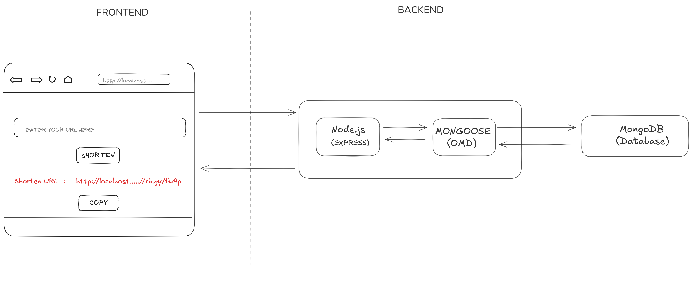

# URL-Shortner

Built a custom URL shortner used for creating short url and giving the url a  unique shortid.
The unquie id redirects the user to the orignial url.

## TECHNOLOGIES USED

 
### BACKEND TECH:
 ◦[Express](https://expressjs.com/)  Node.js framework used for buildin REST API 
 ◦[MongoDB](https://www.mongodb.com/) Document oriented NoSQL database 
 ◦[Mongoose](https://mongoosejs.com/) MongoDB database object modeling tool 
 ◦[ShortID](https://www.npmjs.com/package/shortid) Used for generating unqiue and random id for a given URL of some particular length 
### FRONTEND TECH:
 ◦[HTML and CSS](https://en.wikipedia.org/wiki/CSS) Used for styling the page  

## Architecture:
THE WORK FLOW OF THE URL SHORTNER:

### Future upgrades :
Will try to make the Frontend more attractive and resposive using frontend tech.
This is purely backend porject and will work on frontend in upcoming days.

